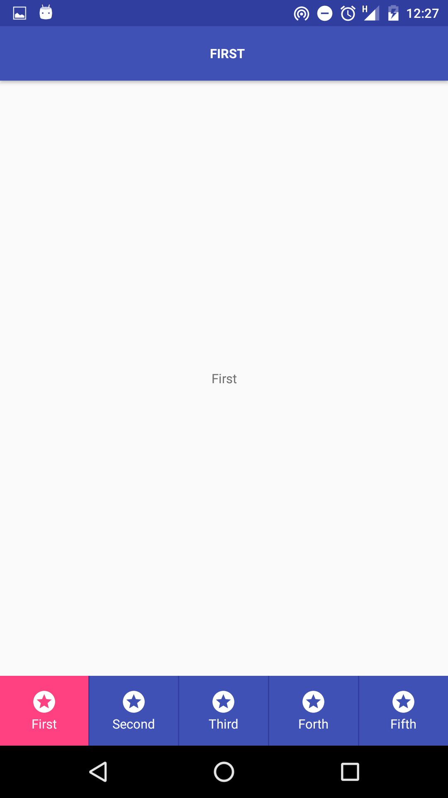

#Android Navigation Examples
Examples of common Android navigation patterns:
- Swipe with tabs https://www.google.com/design/spec/components/tabs.html
- Navigation drawer https://www.google.com/design/spec/patterns/navigation-drawer.html
- Bottom bar https://www.google.com/design/spec/components/bottom-navigation.html#

  

